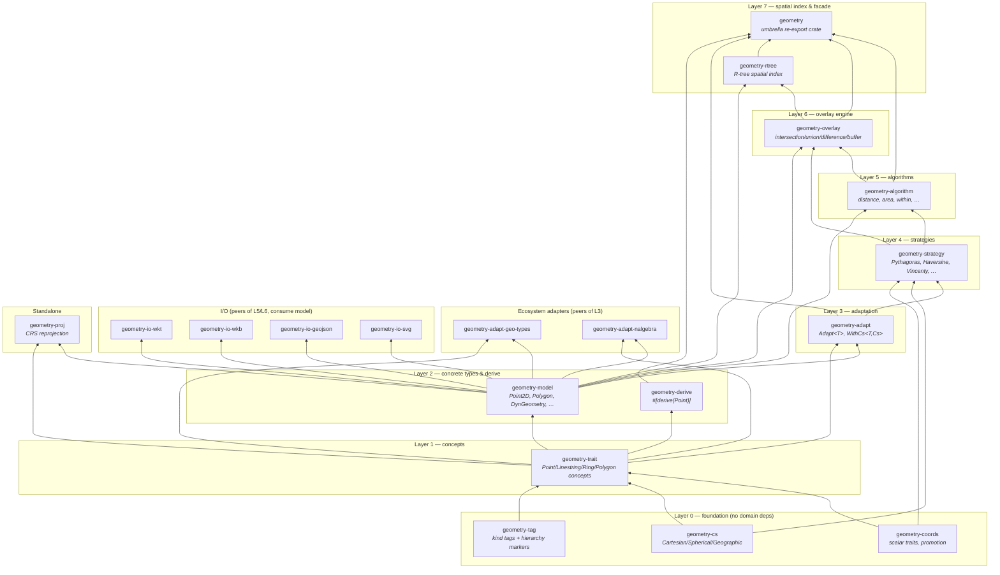

# Architecture — the dependency spine

This is a Rust port of [Boost.Geometry](https://www.boost.org/doc/libs/release/libs/geometry/),
organised as an 18-crate Cargo workspace. Every crate mirrors one or more
`boost/geometry/**` headers (each crate's `lib.rs` names the exact header it
mirrors). The workspace is not a grab-bag of modules — it is a **dependency
spine**: foundational crates at the bottom, derived crates stacked above,
arrows always pointing rootward. No cycles.

This page is the map. It answers "where does concept X live, and what does
it depend on."

## The spine, top to bottom

`cargo` computes this graph mechanically (it's `Cargo.toml`'s
`[dependencies]` per crate), but the diagram groups crates by **conceptual
layer** — what a crate needs, not just its literal `Cargo.toml` edges — so
you can answer "if I want to touch overlay, what do I need to understand
below it?" at a glance.

## Layer-by-layer

### Layer 0 — Foundation

No domain dependencies. These are the nouns every other crate is built from.

| Crate | Mirrors | Owns |
|---|---|---|
| [`geometry-tag`](crates/geometry-tag.md) | `core/{tags,tag,tag_cast}.hpp` | 11 zero-sized kind tags (`PointTag`, `PolygonTag`, …) + 8 hierarchy marker traits (`Single`, `Linear`, `Areal`, …) |
| [`geometry-coords`](crates/geometry-coords.md) | `util/{select_most_precise,calculation_type,math}.hpp` | `CoordinateScalar`, `Promote` (type widening), `Comparable<T>` (skip-sqrt distance) |
| [`geometry-cs`](crates/geometry-cs.md) | `core/cs.hpp`, `srs/spheroid.hpp` | `Cartesian`, `Spherical<U>`, `Geographic<U>`, `Polar<U>`, the `*Family` classifiers, `Spheroid` |

### Layer 1 — Concepts

| Crate | Mirrors | Owns |
|---|---|---|
| [`geometry-trait`](crates/geometry-trait.md) | `doc/concept/*.qbk`, `core/access.hpp` | The concept traits: `Geometry`, `Point`/`PointMut`, `Segment`, `Box`, `Linestring`, `Ring`, `Polygon`, `Multi*`, `GeometryCollection`, `PolyhedralSurface`, `IndexedAccess`, `Closure`, `PointOrder` |

### Layer 2 — Concrete types

| Crate | Mirrors | Owns |
|---|---|---|
| [`geometry-model`](crates/geometry-model.md) | `geometries/{point,segment,box,linestring,ring,polygon,multi_*}.hpp` | `Point2D`, `Point3D`, `Segment`, `Box`, `Linestring`, `Ring`, `Polygon`, `MultiPoint`/`MultiLinestring`/`MultiPolygon`, `DynGeometry` (runtime-tagged enum), `polygon!`/`linestring!`/`point!` macros |
| [`geometry-derive`](crates/geometry-derive.md) | `geometries/register/point.hpp` (`BOOST_GEOMETRY_REGISTER_POINT_2D`) | `#[derive(Point)]` proc-macro |

### Layer 3 — Adaptation

| Crate | Mirrors | Owns |
|---|---|---|
| [`geometry-adapt`](crates/geometry-adapt.md) | `geometries/adapted/*.hpp`, `geometries/register/*.hpp` | `Adapt<T>` (shape-only wrapper for foreign layouts), `WithCs<T, Cs>` (CS re-tagging), `register_linestring!`/`register_ring!`/`register_polygon!` |

### Layer 4 — Strategies

| Crate | Mirrors | Owns |
|---|---|---|
| [`geometry-strategy`](crates/geometry-strategy.md) | `strategies/{cartesian,spherical,geographic}/*.hpp` | One strategy trait per algorithm (`DistanceStrategy`, `AreaStrategy`, …); concrete strategies per CS family (`Pythagoras`, `Haversine`, `Andoyer`, `Vincenty`, `Thomas`, `DouglasPeucker`, `MonotoneChain`, …) |

### Layer 5 — Algorithms

| Crate | Mirrors | Owns |
|---|---|---|
| [`geometry-algorithm`](crates/geometry-algorithm.md) | `algorithms/*.hpp` | Free functions users call: `distance`, `area`, `length`, `within`, `intersects`, `centroid`, `convex_hull`, `simplify`, `transform`, `correct`, … (34 modules) |

### Layer 6 — Overlay engine

| Crate | Mirrors | Owns |
|---|---|---|
| [`geometry-overlay`](crates/geometry-overlay.md) | `algorithms/detail/overlay/` | The boolean-overlay pipeline: robust predicates → turn graph → traversal → ring assembly → `intersection`/`union`/`difference`/`sym_difference`/`buffer`/`relate`/`is_valid`. See the [overlay deep-dive](03-overlay-engine.md). |

### Layer 7 — Spatial index & facade

| Crate | Mirrors | Owns |
|---|---|---|
| [`geometry-rtree`](crates/geometry-rtree.md) | `index/rtree.hpp` | `Rtree<T, Params>` — bounding-box spatial index, `Linear`/`Quadratic` split strategies, k-NN |
| [`boost_geometry`](crates/geometry.md) | `geometry.hpp` | Umbrella facade — re-exports every crate above under one namespace |

### Peers — ecosystem adapters (same layer as `geometry-adapt`)

| Crate | Adapts |
|---|---|
| [`geometry-adapt-geo-types`](crates/geometry-adapt-geo-types.md) | [`geo-types`](https://docs.rs/geo-types) — the de-facto Rust geo ecosystem crate |
| [`geometry-adapt-nalgebra`](crates/geometry-adapt-nalgebra.md) | [`nalgebra`](https://nalgebra.org)'s `Point2`/`Point3`/`Vector2`/`Vector3` |

### Peers — I/O (consume `geometry-model`, sit beside algorithm/overlay)

| Crate | Format | Spec |
|---|---|---|
| [`geometry-io-wkt`](crates/geometry-io-wkt.md) | Well-Known Text | OGC SFA-1 §7 |
| [`geometry-io-wkb`](crates/geometry-io-wkb.md) | Well-Known Binary | OGC 06-103r4 §8 |
| [`geometry-io-geojson`](crates/geometry-io-geojson.md) | GeoJSON | RFC 7946 |
| [`geometry-io-svg`](crates/geometry-io-svg.md) | SVG | debugging convenience, mirrors `io/svg/svg_mapper.hpp` |

### Standalone — not in Boost

| Crate | Purpose |
|---|---|
| [`geometry-proj`](crates/geometry-proj.md) | CRS reprojection via pure-Rust [`proj4rs`](https://crates.io/crates/proj4rs) — Boost leaves this to an unsupported extension |

## Why this shape

Every arrow points toward layer 0. `geometry-tag` knows nothing about
`geometry-overlay`; `geometry-overlay` depends on `geometry-algorithm` (for
`within`/`ring_area`) and `geometry-strategy`, never the reverse. This is
enforced structurally, not by convention — Cargo will refuse to compile a
cycle. One real consequence already documented in the overlay crate itself:
the four overlay free functions (`intersection`, `union`, `difference`,
`sym_difference`) were originally planned to live in `geometry-algorithm`,
but that would have required `geometry-algorithm → geometry-overlay →
geometry-algorithm`, a cycle. They live in `geometry-overlay` instead, and
`geometry-algorithm` never depends on it.

## `no_std`

The four foundation-through-model crates (`geometry-tag`, `geometry-coords`,
`geometry-cs`, `geometry-trait`) plus most of the layers above build
`#![no_std]` (`alloc`-only where they need heap containers). Only I/O and a
few edge crates need `std`.

## `unsafe_code`

The workspace lint (`Cargo.toml`) is `unsafe_code = "forbid"` — every crate
in this graph is `#![forbid(unsafe_code)]`. There is no unsafe carve-out
anywhere in the port today.

## Where to go next

* New to the codebase? Read the [tag-dispatch pattern](02-tag-dispatch-pattern.md) next —
  it explains the one recurring idiom that shows up in every algorithm crate.
* Want the overlay engine specifically? [Overlay deep-dive](03-overlay-engine.md).
* Want one crate's full symbol list? [`crates/`](crates/) has one page per crate.
* Back to the [documentation index](README.md).
