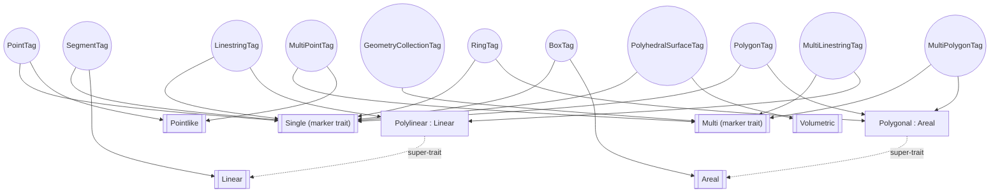
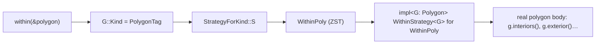

# The tag-dispatch pattern

This is the one idiom that recurs across `geometry-tag`, `geometry-trait`,
`geometry-strategy`, and `geometry-algorithm`. Once it clicks, most of the
codebase's shape becomes predictable — every "one function, many geometry
kinds" problem in this library is solved the same way.

## The problem C++ solves with template specialisation

Boost.Geometry is generic over *any* type that satisfies a concept
(`Point`, `Ring`, `Polygon`, …), and it needs one function
(`boost::geometry::distance(a, b)`) to behave differently depending on
**which** concept `a` and `b` satisfy. C++ does this with tag dispatch:
`traits::tag<T>::type` produces an empty tag struct, and template
specialisation picks the right implementation for that tag.

Rust has no template specialisation. `impl<G: Ring> Foo for G` and
`impl<G: Polygon> Foo for G` on the same trait conflict — the compiler
cannot prove `Ring` and `Polygon` are disjoint (`error[E0119]`), even though
they are. Two independently-refuted attempts show why the obvious fixes don't work:

* **F-a.** Two concept blankets on the same trait+`Self` collide (`E0119`).
* **F-b.** You cannot recover the concept from the tag alone —
  `G: Geometry<Kind = RingTag>` does not let you call `g.points()`; you
  cannot narrow a trait method's bound to `+ Ring` inside an impl
  (`E0276`/`E0599`).

## The tag hierarchy (Layer 0)

Before the dispatch pattern, every kind needs an identity and a place in a
category hierarchy. `geometry-tag` supplies both:



Eleven zero-sized tag structs (`PointTag`, `RingTag`, …) each implement one
or more **marker traits** (`Single`, `Linear`, `Areal`, …). A Rust
super-trait bound (`trait Polylinear: Linear {}`) reproduces C++'s
`polylinear_tag : linear_tag` struct inheritance. This gets you **category**
dispatch for free — `fn f<T: Linear>()` accepts `SegmentTag`,
`LinestringTag`, and `MultiLinestringTag` in one signature, the Rust
equivalent of `tag_cast<Tag, ..., linear_tag>`
(`boost/geometry/core/tag_cast.hpp`).

What tags alone *cannot* do is what F-b above describes: get you from "this
is a `RingTag`" to "therefore I can call `Ring`-concept methods on it."
That needs the second half of the pattern.

## The resolved pattern — distinct strategy struct per kind

The proven design (v2; an earlier tag-dispatched-trait v1 was refuted by
F-a/F-b above) has three pieces, per algorithm:

**1. One zero-sized strategy struct per kind, each the *sole* impl of the
strategy trait for that struct** — distinct `Self` types sidestep F-a
entirely, and each impl can freely bound on its own concept:

```rust
#[derive(Default)] struct WithinRing;
#[derive(Default)] struct WithinPoly;

impl<G: Ring> WithinStrategy<G> for WithinRing {
    fn within(&self, g: &G) -> bool { /* real ring body — g.points() works */ }
}
impl<G: Polygon> WithinStrategy<G> for WithinPoly {
    fn within(&self, g: &G) -> bool { /* real polygon body */ }
}
```

**2. A tag → struct picker**, disjoint on the tag type itself (tags never
collide, so this impl-per-tag never hits E0119):

```rust
trait StrategyForKind { type S: Default; }
impl StrategyForKind for RingTag    { type S = WithinRing; }
impl StrategyForKind for PolygonTag { type S = WithinPoly; }
```

**3. One public free function** that resolves `G::Kind → S` and calls
through it — the call site never sees the dispatch:

```rust
pub fn within<G: Geometry>(g: &G) -> bool
where G::Kind: StrategyForKind,
{
    <G::Kind as StrategyForKind>::S::default().within(g)
}
```



This is **zero-cost**: every layer is a zero-sized type and a static trait
resolution. At `-O`, the whole chain collapses to a single direct call —
verified against compiled proofs-of-concept, unary and binary (the
latter for two-geometry algorithms like `intersects`).

## Where you'll see it in the wild

This exact shape — `XxxStrategy` trait, one struct per kind, a
`XxxStrategyForKind` picker — is not hypothetical; it's already load-bearing
in `geometry-strategy`:

| Algorithm | Strategy trait | Per-kind structs |
|---|---|---|
| `within` | `WithinStrategy` | `WithinRing`, `WithinPoly`, `WithinBox` (+ `WithinStrategyForKind`) |
| `envelope` | `EnvelopeStrategy` | `EnvelopePoint`, `EnvelopeSegment`, `EnvelopeLinestring`, `EnvelopeRing`, `EnvelopePolygon`, `EnvelopeBox`, `EnvelopeMultiPoint`, `EnvelopeMultiLinestring`, `EnvelopeMultiPolygon` (+ `EnvelopeStrategyForKind`) |
| `centroid` | `CentroidStrategy` | `CartesianPolygonCentroid`, `CartesianRingCentroid`, `CartesianLinestringCentroid`, `CartesianSegmentCentroid`, `CartesianBoxCentroid`, `CartesianMultiPointCentroid` (+ `CentroidStrategyForKind`) |
| `intersects` | `IntersectsStrategy` / `IntersectsPairStrategy` | `CartesianIntersects` (binary — the "per-pair" arity) |
| `equals` | `EqualsStrategy` / `EqualsPairStrategy` | `EqPointPoint`, `EqSegmentSegment`, `EqPolygonPolygon` |

## The second axis — coordinate-system family

A strategy also has to pick *which formula* based on the coordinate-system
family (Cartesian vs. Spherical vs. Geographic), completely orthogonally to
the kind dispatch above. That axis uses [`geometry_tag::SameAs`] as a
compile-time `std::is_same` and a `DefaultXxx<Family>` trait per algorithm
(`DefaultDistance<CartesianFamily> { type Strategy = Pythagoras; }`,
`DefaultDistance<SphericalFamily> { type Strategy = Haversine; }`, …). See
`geometry-strategy`'s crate docs (`crates/geometry-strategy/src/lib.rs`) for
the full worked example — it is the canonical "how to write a new strategy"
walkthrough in the codebase.

## Back to [the index](README.md) · [Architecture](01-architecture.md) · [Overlay deep-dive](03-overlay-engine.md)
