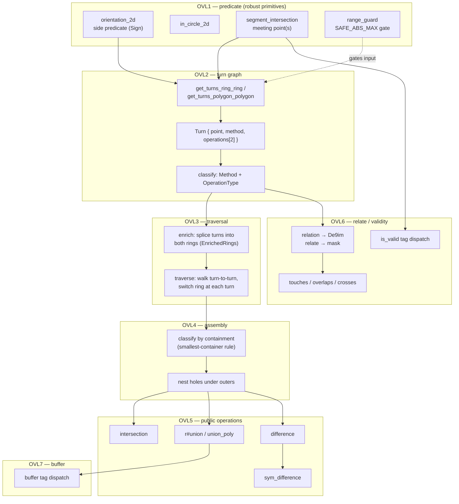

# Overlay engine deep-dive

`geometry-overlay` is the largest single subsystem in the port. It powers
`intersection`, `r#union`, `difference`, `sym_difference`, and indirectly
`buffer`, `is_valid`, `relate`, `crosses`, `overlaps`, `touches`, and
`point_on_surface`. Boost concentrates all of this under one `detail/`
directory (`boost/geometry/algorithms/detail/overlay/`); the port gives it
its own crate because the algorithmic surface is too dense to share with
anything else — see [architecture](01-architecture.md) for why this also
avoids a dependency cycle with `geometry-algorithm`.

## The pipeline

## Stage by stage

### OVL1 — Robust predicate layer (`predicate.rs` + submodules)

Every overlay operation eventually calls down into this layer. It is the
boundary between "raw coordinates" and "topological decisions."

* **`orientation`** — signed-area side predicate (`Sign`): given three
  points, which side of the line through the first two does the third fall
  on. Mirrors `strategy/cartesian/side_by_triangle.hpp`.
* **`in_circle`** — the in-circle predicate, used by `is_valid` and the turn
  graph.
* **`segment_intersection`** — segment-segment intersection returning the
  meeting point(s) (`SegmentIntersection`). Mirrors
  `strategy/cartesian/intersection.hpp`.
* **`range_guard`** — the robustness gate: `SAFE_ABS_MAX` bounds the
  coordinate magnitude the exact-arithmetic predicates can trust. Past that
  range, the kernel refuses (`RangeError`) instead of silently returning a
  wrong sign.

**Robustness policy (v1):** exact input arithmetic, no rescale. The
predicates compute directly on `f64` inputs; `range_guard` refuses inputs
outside the safe range rather than guessing, leaving a slot for a future
rescale policy. This is a real, load-bearing decision — several
regression tests exist specifically because early versions let
out-of-range coordinates silently empty the turn graph, which then read as
"disjoint" and produced a *confidently wrong* answer (e.g. reporting
intersection area as ~4× too large). The fix in every case was the same
shape: **refuse (`OverlayError::Unsupported`) rather than return a value
that looks plausible but is wrong.**

### OVL2 — Turn graph (`turn.rs` + submodules)

A **turn** is an intersection point between the two input geometries'
boundaries, carried with the metadata traversal needs.

* **`info`** — the data model: `Turn { point, method, operations: [Operation; 2] }`,
  `Method` (how the segments meet: crossing, touching, collinear, …),
  `OperationType`, `SegmentId`, `RingKind`.
* **`get_turns`** — `get_turns_ring_ring` / `get_turns_polygon_polygon`
  collect every turn between two rings (or polygons).
* **`classify`** — assigns each turn's `Method` and its two `Operation`s
  (what each side should do at this turn — continue on this ring, or switch
  to the other).

### OVL3 — Traversal (`traverse.rs` + `enrich`/`state`)

The densest single piece of overlay — described in its own module docs as
"a clean-room implementation of the classic Weiler–Atherton ring traversal
the turn graph encodes, rather than a transliteration of Boost's template
machinery."

1. **Enrich** (`enrich`) — splice every turn into *both* rings it lies on,
   so each ring becomes an alternating walk of original vertices and turn
   points, and every turn knows its position on both rings.
2. **Walk** (`state`, exposed as `traverse`) — start at an unvisited
   crossing turn whose operation matches the requested op, follow the
   current ring until the next turn, **switch to the other ring** there,
   repeat until the walk returns to its start — emitting one output ring.
   Repeat until every crossing turn is visited.

For **intersection**, the walk keeps arcs that lie *inside* the other
polygon; for **union**, arcs *outside*; **difference** is union against the
reversed second polygon (reversing swaps "inside" and "outside" for that
input). Which arc that is at each turn is decided from the crossing's
`OperationType`.

**Scope (v1):** the clean, non-degenerate areal case — simple polygons
whose boundaries cross transversally. Clustered turns (three-or-more
segments meeting at a point), self-intersections, and long collinear
overlaps are deferred (they are the two hardest sub-problems in Boost's
own history). Inputs that
hit them return `TraversalError::Unsupported` rather than a wrong ring —
the same "refuse, don't guess" contract as OVL1's range guard.

### OVL4 — Assembly (`assemble.rs`)

Traversal produces a **flat list of rings**. Assembly classifies each as an
outer boundary or a hole and nests holes under their containing outer,
building `Polygon`s and collecting them into a `MultiPolygon`.

**Classification is by containment, not winding.** A ring contained by no
other ring is an outer; a ring contained by exactly one outer is that
outer's hole. Containment uses `within()` on a **representative interior
point** (via `point_on_surface`, not just any vertex — a hole often shares a
vertex or edge with its outer, and `within` is strict-interior so a boundary
point would misclassify it). Ties break toward the **smallest** container,
and the container must have **strictly larger area** — this is what keeps
the containment relation acyclic even when an outer and a same-winding hole
would otherwise both appear to "contain" each other via a shared
representative point. Three regression tests in `assemble.rs` exist
specifically for these edge cases (same-winding hole, vertex-sharing hole).

### OVL5 — Public operations (`operation.rs`)

Thin orchestration over the pipeline above:
`get_turns → enrich → traverse → assemble`.

| Function | Boost equivalent | Behavior on no crossings |
|---|---|---|
| `intersection(a, b)` | `algorithms/intersection.hpp` | inner polygon if one contains the other, else empty |
| `r#union(a, b)` | `algorithms/union.hpp` (raw identifier because `union` is a Rust keyword; `union_poly` remains as a compatibility name) | outer polygon if one contains the other, else both side by side |
| `difference(a, b)` | `algorithms/difference.hpp` | `A` whole if disjoint; empty if `A` inside `B`; **refused** if `B` inside `A` (would need a hole the exterior-only assembler can't build yet) |
| `sym_difference(a, b)` | `algorithms/sym_difference.hpp` | computed as `(A−B) ∪ (B−A)`, concatenated since the two differences are disjoint by construction |

**v1 scope:** polygon × polygon → `MultiPolygon`, operating on each input's
**exterior ring only**. A polygon with holes is refused
(`OverlayError::Unsupported`) rather than silently treated as solid — same
"refuse over silently wrong" contract throughout this crate.

### OVL6 — Relate & validity (`relate.rs`, `validity.rs`)

* **`relation`** computes a DE-9IM 3×3 matrix (`De9im`) — for each pair drawn
  from {Interior, Boundary, Exterior} of the two geometries, the
  *dimension* of their intersection (`Dimension::{Empty,Point,Curve,Area}`).
  **`relate`** tests that matrix against a DE-9IM mask; `touches`, `overlaps`,
  and `crosses` are thin predicates over the same matrix. Cartesian dispatch
  covers static single kinds, homogeneous multis, runtime geometries, and
  heterogeneous geometry collections. Collection topology uses OGC union
  semantics, including mod-2 multiline boundaries.
* **`is_valid`** tag-dispatches to the ring/polygon validators (and validates
  each multi-polygon member). The validators check the OGC simple-feature rules:
  finite in-range coordinates, enough points, closed boundary, no spikes, no
  consecutive duplicate points, no self-intersections, correct orientation,
  and (for polygons) every interior ring covered by the exterior. Deferred:
  ring×ring edge-crossing between a hole and the exterior/other holes and
  intersections between distinct multi-polygon members.

Both `relate` and the boolean ops share the same honesty policy: a
non-transversal boundary contact (edge-aligned or vertex-only) that the
turn graph cannot disambiguate from a genuine area overlap returns
`OverlayError::Unsupported` rather than guessing `false`. The
`edge_aligned_overlap_is_unsupported_not_false` regression test documents
exactly this failure mode being caught.

### OVL7 — Buffer (`buffer.rs`)

The public `buffer` entry tag-dispatches every static single and homogeneous
multi kind and grows or erodes it using explicit distance, side, join, end,
and point roles. Cartesian offsets are native and include holes, non-convex
polygons, signed distances, asymmetric linear widths, capped miters, and
round/flat ends. Spherical and geographic inputs use family-selected radius
or spheroid bundles, project into a local tangent plane, reuse the Cartesian
engine, and transform back. That angular path is an intentional local-extent
approximation; the feature-parity assumptions identify global/polar accuracy
as the revisit trigger.

## The recurring design principle: refuse, don't guess

Reading the module docs and regression-test names across this crate, one
policy shows up again and again, and it is worth internalizing before
touching any of this code:

> **When the turn graph or a predicate cannot distinguish a genuine
> geometric case from a degenerate one, return `Unsupported` — never a
> value that looks plausible but might be wrong.**

Concretely, every one of these is a documented past bug, now guarded by a
regression test:

* Out-of-range coordinates silently emptying the turn graph → misread as
  "disjoint" → intersection area over-reported ~4×. Now refused up front by
  `range_guard`.
* A polygon with holes silently treated as solid. Now refused by `has_holes`
  checks in every OVL5 function.
* Edge-aligned/vertex-only boundary contact silently reported as
  `overlaps = false`. Now refused by `relate`.
* `A − B` when `B` is strictly inside `A` (needs a hole) silently returned
  as `A` whole (over-reporting area). Now refused rather than wrong.

If you extend this crate, preserve that contract: a new degenerate case you
discover should get an `Unsupported` arm and a regression test, not a
best-effort guess.

## Back to [the index](README.md) · [Architecture](01-architecture.md) · [Tag-dispatch pattern](02-tag-dispatch-pattern.md)
