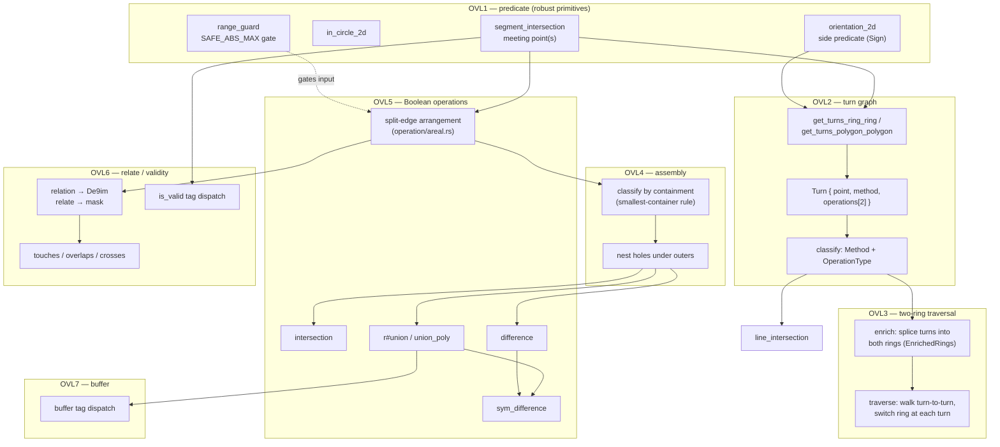

# Overlay engine deep-dive

`geometry-overlay` is the largest single subsystem in the port. It powers
`intersection`, `r#union`, `difference`, `sym_difference`, and indirectly
`buffer`, `is_valid`, `relate`, `crosses`, `overlaps`, `touches`, and
`point_on_surface`. Boost concentrates all of this under one `detail/`
directory (`boost/geometry/algorithms/detail/overlay/`); the port gives it
its own crate because the algorithmic surface is too dense to share with
anything else — see [architecture](01-architecture.md) for why this also
avoids a dependency cycle with `geometry-algorithm`.

## The pipeline

```mermaid
flowchart TD
    subgraph OVL1["OVL1 — predicate (robust primitives)"]
        orientation["orientation_2d<br/>side predicate (Sign)"]
        in_circle["in_circle_2d"]
        seg_int["segment_intersection<br/>meeting point(s)"]
        range_guard["range_guard<br/>SAFE_ABS_MAX gate"]
    end

    subgraph OVL2["OVL2 — turn graph"]
        get_turns["get_turns_ring_ring /<br/>get_turns_polygon_polygon"]
        turn_info["Turn { point, method, operations[2] }"]
        classify["classify: Method + OperationType"]
    end

    subgraph OVL3["OVL3 — two-ring traversal"]
        enrich["enrich: splice turns into<br/>both rings (EnrichedRings)"]
        walk["traverse: walk turn-to-turn,<br/>switch ring at each turn"]
    end

    subgraph OVL4["OVL4 — assembly"]
        classify_rings["classify by containment<br/>(smallest-container rule)"]
        nest["nest holes under outers"]
    end

    subgraph OVL5["OVL5 — Boolean operations"]
        arrangement["split-edge arrangement<br/>(operation/areal.rs)"]
        intersection_fn["intersection"]
        union_fn["r#union / union_poly"]
        difference_fn["difference"]
        symdiff_fn["sym_difference"]
    end

    subgraph OVL6["OVL6 — relate / validity"]
        relate_fn["relation → De9im<br/>relate → mask"]
        preds["touches / overlaps / crosses"]
        is_valid["is_valid tag dispatch"]
    end

    subgraph OVL7["OVL7 — buffer"]
        buffer_fn["buffer tag dispatch"]
    end

    orientation --> get_turns
    seg_int --> get_turns
    range_guard -.gates input.-> arrangement
    get_turns --> turn_info --> classify
    classify --> enrich --> walk
    classify --> line_int["line_intersection"]
    seg_int --> arrangement
    arrangement --> classify_rings --> nest
    nest --> intersection_fn
    nest --> union_fn
    nest --> difference_fn
    difference_fn --> symdiff_fn
    union_fn --> symdiff_fn
    arrangement --> relate_fn --> preds
    seg_int --> is_valid
    union_fn --> buffer_fn
```

## Stage by stage

### OVL1 — Robust predicate layer (`predicate.rs` + submodules)

Every overlay operation eventually calls down into this layer. It is the
boundary between "raw coordinates" and "topological decisions."

* **`orientation`** — signed-area side predicate (`Sign`): given three
  points, which side of the line through the first two does the third fall
  on. Mirrors `strategy/cartesian/side_by_triangle.hpp`.
* **`in_circle`** — the in-circle predicate, used by `is_valid` and the turn
  graph.
* **`segment_intersection`** — segment-segment intersection returning the
  meeting point(s) (`SegmentIntersection`). Mirrors
  `strategy/cartesian/intersection.hpp`.
* **`range_guard`** — the robustness gate: `SAFE_ABS_MAX` bounds the
  coordinate magnitude the exact-arithmetic predicates can trust. Past that
  range, the kernel refuses (`RangeError`) instead of silently returning a
  wrong sign.

**Robustness policy (v1):** exact input arithmetic, no rescale. The
predicates compute directly on `f64` inputs; `range_guard` refuses inputs
outside the safe range rather than guessing, leaving a slot for a future
rescale policy. This is a real, load-bearing decision — several
regression tests exist specifically because early versions let
out-of-range coordinates silently empty the turn graph, which then read as
"disjoint" and produced a *confidently wrong* answer (e.g. reporting
intersection area as ~4× too large). The fix in every case was the same
shape: **refuse (`OverlayError::Unsupported`) rather than return a value
that looks plausible but is wrong.**

### OVL2 — Turn graph (`turn.rs` + submodules)

A **turn** is an intersection point between the two input geometries'
boundaries, carried with the metadata traversal needs. The turn graph is a
public building block — `line_intersection` classifies its meeting points
with it, and OVL3 walks it — but the Boolean operations collect their
crossings inside the arrangement kernel instead (OVL5).

* **`info`** — the data model: `Turn { point, method, operations: [Operation; 2] }`,
  `Method` (how the segments meet: crossing, touching, collinear, …),
  `OperationType`, `SegmentId`, `RingKind`.
* **`get_turns`** — `get_turns_ring_ring` / `get_turns_polygon_polygon`
  collect every turn between two rings (or polygons).
* **`classify`** — assigns each turn's `Method` and its two `Operation`s
  (what each side should do at this turn — continue on this ring, or switch
  to the other).

### OVL3 — Two-ring traversal (`traverse.rs` + `enrich`/`state`)

A standalone walker over the OVL2 turn graph of two rings — described in its
own module docs as
"a clean-room implementation of the classic Weiler–Atherton ring traversal
the turn graph encodes, rather than a transliteration of Boost's template
machinery."

1. **Enrich** (`enrich`) — splice every turn into *both* rings it lies on,
   so each ring becomes an alternating walk of original vertices and turn
   points, and every turn knows its position on both rings.
2. **Walk** (`state`, exposed as `traverse`) — start at an unvisited
   crossing turn whose operation matches the requested op, follow the
   current ring until the next turn, **switch to the other ring** there,
   repeat until the walk returns to its start — emitting one output ring.
   Repeat until every crossing turn is visited.

For **intersection**, the walk keeps arcs that lie *inside* the other
polygon; for **union**, arcs *outside*; **difference** is union against the
reversed second polygon (reversing swaps "inside" and "outside" for that
input). Which arc that is at each turn is decided from the crossing's
`OperationType`.

**Where result lobes touch.** The Boolean operations' arrangement walker
(`operation/areal.rs`, `trace_rings`) orients every result edge with the
filled side on its right and leaves each node along the first unused edge
counter-clockwise from the one it arrived on — the edge bounding the same
filled wedge, which is what Boost's `sort_by_side` cluster selection does.
So two result lobes that touch at one point, or at several, come out as
separate polygons and the region between them is never walked. The one case
where a walk revisits a node is a hole that touches the ring it is on; the
loop is cut there into the outer ring and the hole. Taking the smallest turn
instead spliced touching lobes into one outline with the region between them
as a hole against its own outer ring — the `DisconnectedInterior` result the
`every_boolean_result_over_the_fixtures_is_valid` sweep in
`overlay_parity.rs` now guards against.

**Scope of `traverse`:** the clean, non-degenerate case — two simple rings
whose boundaries cross transversally. Clustered turns (three or more
segments meeting at a point), self-intersections, and long collinear
overlaps return `TraversalError::Unsupported` rather than a wrong ring. The
Boolean operations do not have that limit: their arrangement kernel (OVL5)
handles all three.

### OVL4 — Assembly (`assemble.rs`)

Traversal produces a **flat list of rings**. Assembly classifies each as an
outer boundary or a hole and nests holes under their containing outer,
building `Polygon`s and collecting them into a `MultiPolygon`.

**Classification is by containment, not winding.** A ring contained by no
other ring is an outer; a ring contained by exactly one outer is that
outer's hole. Containment uses `within()` on a **representative interior
point** (via `point_on_surface`, not just any vertex — a hole often shares a
vertex or edge with its outer, and `within` is strict-interior so a boundary
point would misclassify it). Ties break toward the **smallest** container,
and the container must have **strictly larger area** — this is what keeps
the containment relation acyclic even when an outer and a same-winding hole
would otherwise both appear to "contain" each other via a shared
representative point. Three regression tests in `assemble.rs` exist
specifically for these edge cases (same-winding hole, vertex-sharing hole).

### OVL5 — Boolean operations (`operation.rs`)

`operation/areal.rs` mirrors the combined role of Boost's turn collection,
colocation handling, enrichment, traversal, and ring selection with a planar
**split-edge arrangement**. Every boundary of both operands — exteriors,
holes, every member of a multi-polygon — is split at each crossing and
collinear-overlap endpoint, and where a ring of one operand touches another
ring of the same operand (a hole touching its exterior); a vertex of one
operand within the snap distance of the other's segment splits it too. The
two sides of each atomic edge are classified against the requested operation
by containment — an operand that runs along the edge is sampled either side
of its own segment, closer than any other of its edges comes, and one that
does not is asked at the edge itself — leaving a directed result-boundary
graph that `trace_rings` walks with the cluster rule described above; Boost's rule for which
self-touch points a traced ring passes through, the ring start Boost's
`get_turns` section order gives, and its collinear clean-up are reproduced so
output rings match Boost's vertex for vertex. OVL4 then assembles the rings.

| Function | Boost equivalent | Notes |
|---|---|---|
| `intersection(a, b)` | `algorithms/intersection.hpp` | |
| `r#union(a, b)` | `algorithms/union.hpp` (raw identifier because `union` is a Rust keyword; `union_poly` remains as a compatibility name) | |
| `difference(a, b)` | `algorithms/difference.hpp` | the second operand is read backwards, as Boost reads it; an operand strictly inside the first becomes a hole |
| `sym_difference(a, b)` | `algorithms/sym_difference.hpp` | the union of `a − b` and `b − a`, as Boost builds it |

Each has a `*_multi` form taking two multi-polygons. Inputs may carry holes,
touch, share edges, or contain one another. Because faces are classified by
containment, the result does not depend on the operands' ring orientation,
where Boost reads its declared orientation and returns garbage for rings
wound the other way. Operands that come closer than the snap distance
(`1e-10` of the coordinate scale) without meeting — near copies of each
other, a vertex a hair off an edge — can leave a sliver whose sides no
sample tells apart; a stretch that short is settled so the boundary closes,
and an arrangement that still does not close is made again at a coarser snap
(`1e-7`), which folds the sliver into the edges it hugs. The integer
coordinate scalars are refused at compile time — a crossing is a fractional
point — and coordinates outside the predicate range are refused at run time
(`OverlayError::Unsupported`), as is an arrangement that does not close even
at the coarser snap.

### OVL6 — Relate & validity (`relate.rs`, `validity.rs`)

* **`relation`** computes a DE-9IM 3×3 matrix (`De9im`) — for each pair drawn
  from {Interior, Boundary, Exterior} of the two geometries, the
  *dimension* of their intersection (`Dimension::{Empty,Point,Curve,Area}`).
  **`relate`** tests that matrix against a DE-9IM mask; `touches`, `overlaps`,
  and `crosses` are thin predicates over the same matrix. Cartesian dispatch
  covers static single kinds, homogeneous multis, runtime geometries, and
  heterogeneous geometry collections. Collection topology uses OGC union
  semantics, including mod-2 multiline boundaries.
  A point of either geometry is located the way Boost locates a point —
  the winding rule with its epsilon side test (`point_in_geometry`) — so
  `relate` agrees with `within` and `covered_by`; crossings and samples the
  engine computes are located within the rounding their construction left.
* **`is_valid`** tag-dispatches to the ring, polygon, and multi-polygon
  validators, in Boost's phase order: each ring on its own (coordinates,
  size, topological dimension, closure, duplicates, spikes, orientation),
  then the turns between rings (`failure_self_intersections`), holes inside
  the exterior and not nested, and a connected interior
  (`failure_disconnected_interior`); multi-polygon members may touch only at
  isolated points and may not nest (`failure_intersecting_interiors`).
  `ValidityOptions::BOOST_DEFAULT` accepts consecutive duplicates as Boost's
  default policy does; `is_valid` itself is the strict policy.

`relate` and the Boolean operations refuse coordinates outside the range
their exact predicates trust (`OverlayError::Unsupported`), and the Boolean
operations an arrangement they cannot close (OVL5); every boundary contact —
edge-aligned, vertex-only, a hole touching its exterior — is computed.

### OVL7 — Buffer (`buffer.rs`)

The public `buffer` entry tag-dispatches every static single and homogeneous
multi kind and grows or erodes it using explicit distance, side, join, end,
and point roles. Cartesian offsets are native and include holes, non-convex
polygons, signed distances, asymmetric linear widths, miters drawn back to
their limit, and round/flat ends. A point or linear geometry takes a negative
distance's magnitude, as Boost's distance strategies hand it to them, and an
input that simplifies to a single point is buffered as that point. Spherical and geographic inputs use family-selected radius
or spheroid bundles, project into a local tangent plane, reuse the Cartesian
engine, and transform back. That angular path is an intentional local-extent
approximation; the feature-parity assumptions identify global/polar accuracy
as the revisit trigger.

Polygon offsets work on each ring as Boost does — simplified at a thousandth
of the distance, an exterior that simplifies to a point buffered as that
point — and keep the raw offsetted ring where it is the outline: simple, and
cut at every concave corner within both sides' reach. Where it crosses
itself or another ring — a notch narrower than twice the distance, a neck
thinner than that, a hole whose arm fills in — where a concave cut runs past
a side shorter than it reaches, or where an erosion loses its clearance, the
offset is rebuilt the way Boost builds every buffer: from a side piece per
edge and a join piece per rounded or mitered corner, merged through the
overlay engine and unioned with (growth) or subtracted from (erosion) the
simplified polygon (`buffer.rs`, `dissolve_offset`). That is what closes a
notch into one valid polygon and pinches a thin neck off into separate ones.

Linear offsets walk each side as Boost walks it — the input simplified at a
thousandth of the distance, convex corners joined, concave ones cut where
their offsets cross, spikes and ends capped — and keep that outline where it
is simple and every concave cut is covered by the neighbouring segment's
pieces. Otherwise the buffer is the union of the same pieces, as Boost's
traversal makes it: a line crossing itself, doubling back, or turning
sharper than its segments are long.

## The recurring design principle: refuse, don't guess

Reading the module docs and regression-test names across this crate, one
policy shows up again and again, and it is worth internalizing before
touching any of this code:

> **When the turn graph or a predicate cannot distinguish a genuine
> geometric case from a degenerate one, return `Unsupported` — never a
> value that looks plausible but might be wrong.**

Concretely, every one of these is a documented past bug, now guarded by a
regression test:

* Out-of-range coordinates silently emptying the turn graph → misread as
  "disjoint" → intersection area over-reported ~4×. Refused up front by
  `range_guard`.
* A polygon with holes silently treated as solid, edge-aligned or
  vertex-only boundary contact silently reported as `overlaps = false`, and
  `A − B` with `B` strictly inside `A` silently returned as `A` whole. Each
  was refused first, and is computed now that the arrangement kernel handles
  it.

If you extend this crate, preserve that contract: a new degenerate case you
discover should get an `Unsupported` arm and a regression test until it is
computed right, not a best-effort guess.

## Back to [the index](README.md) · [Architecture](01-architecture.md) · [Tag-dispatch pattern](02-tag-dispatch-pattern.md)
